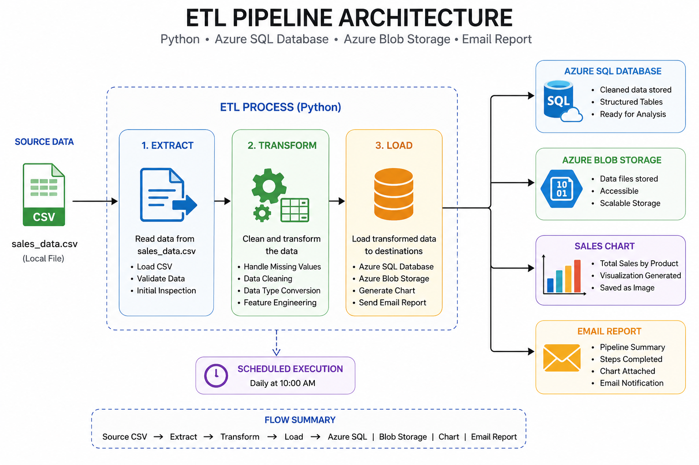
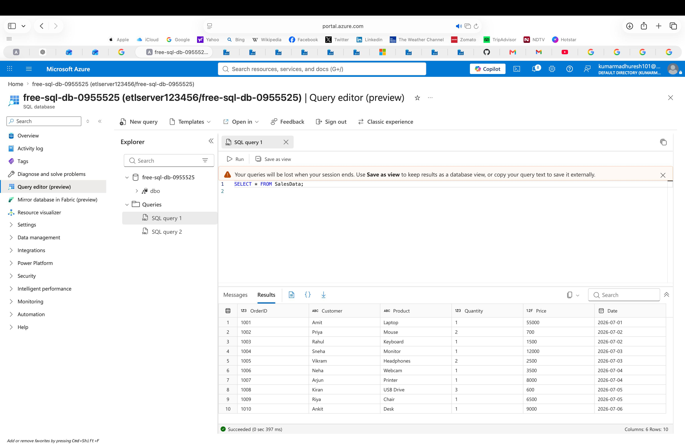
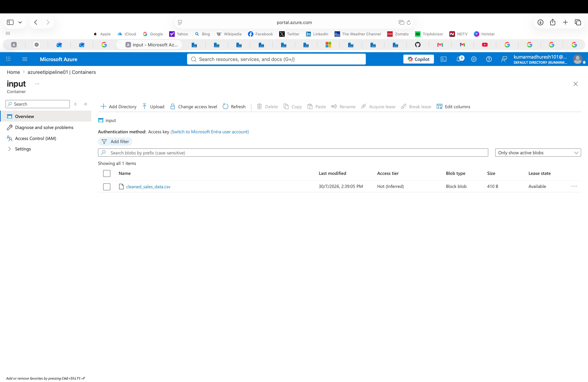
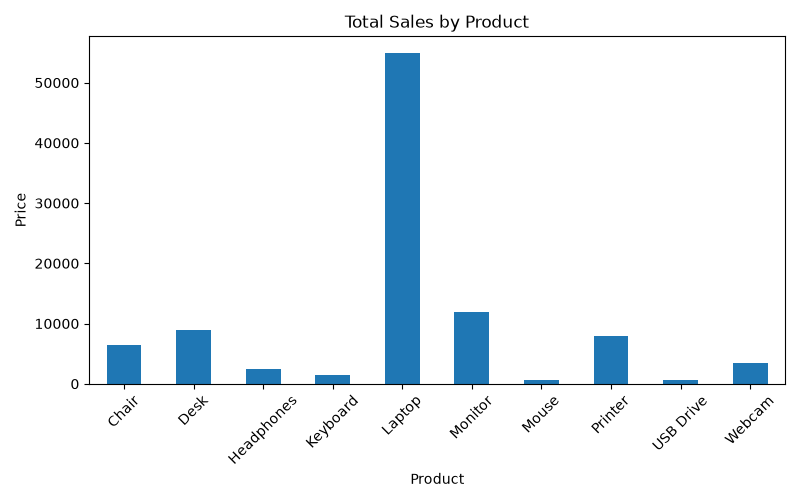
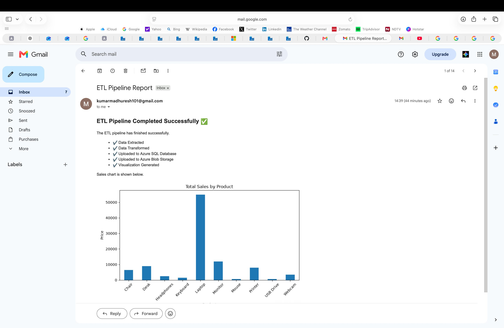

# Azure ETL Pipeline using Python and Microsoft Azure

An end-to-end ETL (Extract, Transform, Load) pipeline built using Python and Microsoft Azure services.

The project extracts sales data from a CSV file, cleans and transforms it, uploads the processed data to Azure SQL Database and Azure Blob Storage, generates a sales chart, and sends an email report automatically.

---

# Project Architecture



---

# Technologies Used

- Python
- Pandas
- Azure SQL Database
- Azure Blob Storage
- Azure Data Factory
- PyODBC
- Azure Storage SDK
- Matplotlib
- Gmail SMTP
- Git
- GitHub

---

# Project Structure

```text
ETL_CAPSTONE/
│
├── adf/
├── assets/
│   ├── architecture.png
│   ├── azure_sql.jpeg
│   ├── azure_blob.jpeg
│   ├── email_report.jpeg
│   └── sales_chart.png
│
├── data/
├── etl/
│   ├── extractor.py
│   ├── transformer.py
│   ├── loader.py
│   ├── azure_loader.py
│   ├── blob_storage.py
│   ├── azure_sql_reader.py
│   ├── emailer.py
│   └── viz.py
│
├── reports/
├── templates/
├── run_etl.py
├── requirements.txt
├── README.md
└── .env.example
```

---

# ETL Workflow

```text
CSV File
    │
    ▼
Extract
    │
    ▼
Transform
    │
    ▼
Save Cleaned CSV
    │
    ├──► Azure SQL Database
    │
    ├──► Azure Blob Storage
    │
    ▼
Generate Sales Chart
    │
    ▼
Send Email Report
```

---

# Features

- Extract sales data from a CSV file
- Clean and transform data using Pandas
- Upload processed data to Azure SQL Database
- Upload the cleaned CSV to Azure Blob Storage
- Generate a sales chart using Matplotlib
- Send an automated HTML email report
- Use environment variables for configuration
- Modular project structure

---

# Running the Project

Install the required packages:

```bash
pip install -r requirements.txt
```

Run the project:

```bash
python run_etl.py
```

---

# Project Output

## Azure SQL Database



---

## Azure Blob Storage



---

## Sales Chart



---

## Email Report



---

# Author

**Madhuresh Kumar**